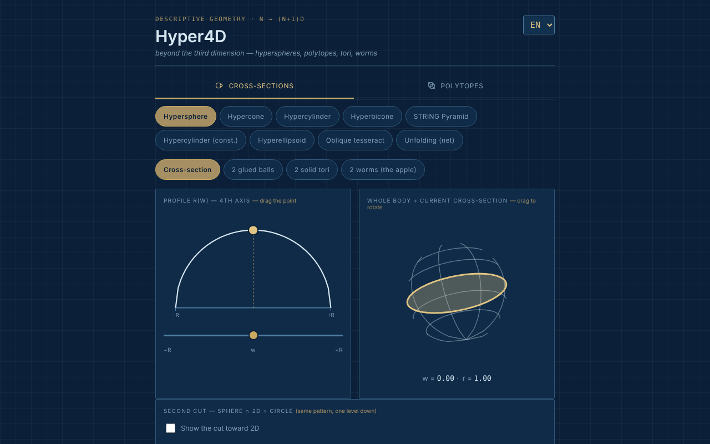

# Hyper4D

Explorator interactiv de geometrie în a patra dimensiune: secțiuni ale hipercorpurilor și proiecții ale politopilor regulați.

**Live:** https://chiuta.github.io/Hyper4D/

## Ce este

Hyper4D este o aplicație single-file (`index.html`, SVG + JavaScript, fără biblioteci) pentru geometria descriptivă „dincolo de a treia dimensiune”, în stilul unui desen tehnic albastru. Are două categorii: **Secțiuni transversale** (cum arată un corp 4D tăiat de un spațiu 3D, parcurgând a patra axă) și **Politopi** (proiecții 4D → 3D → 2D rotite în timp real).

## Funcții

- **Secțiuni transversale:** hipersferă, hipercon, hipercilindru, hipercon dublu (bicon), „Piramida STRING”, hipercilindru (construcție), hiperelipsoid, tesseract oblic, desfășurare (net). Profilul r(w) cu punct tras de mouse, corpul întreg cu secțiunea curentă, „a doua tăietură” (sferă ∩ 2D = cerc).
- Pentru hipersferă, vizualizări: secțiune, „2 bile lipite”, „2 tori plini”, „2 viermi (mărul)” cu număr de viermi selectabil.
- Pentru tesseractul oblic: direcții de tăiere față / muchie / vârf.
- **Politopi:** 5-cell, 8-cell, 16-cell, 24-cell, 600-cell, 120-cell; duoprisme (3,3), (3,5) și (P,Q) personalizat; piramide peste cub, octaedru, dodecaedru, icosaedru; „star skeleton”.
- Rotație dublă 4D (planurile XW și YZ), proiecție în perspectivă sau ortografică, pauză/redare, viteză, „Solid faces”.
- Cartuș cu valori calculate (corp, V·M·F, hipervolum V₄, unghiurile ∠XW și ∠YZ).
- Rotire prin tragere cu mouse-ul, zoom cu rotița sau cu două degete.
- Interfață în 7 limbi: EN (implicit), RO, FR, IT, ES, PT, DE.
- Starea (limbă, categorie, formă, vizualizare) se reflectă în hash-ul URL-ului, deci poate fi pusă la semn sau partajată.

## Manual de utilizare

1. Alege limba din selectorul din colțul antetului (EN / RO / FR / IT / ES / PT / DE).
2. Alege categoria: **Secțiuni transversale** sau **Politopi**.
3. La secțiuni: alege un corp (de exemplu „Hipersferă”) și trage punctul de pe profilul r(w) sau mută sliderul `w` pentru a parcurge a patra axă; trage corpul pentru a-l roti.
4. Bifează „Show the cut toward 2D” (în limba aleasă) pentru a doua tăietură; pentru hipersferă încearcă vizualizările „2 bile lipite”, „2 tori plini”, „2 viermi”.
5. La politopi: alege un poliedru 4D, apoi „Pause”/„Play” pentru rotație, sliderul de viteză și „Solid faces” pentru fețe pline; comută între proiecție în perspectivă și ortografică.
6. Pentru duoprisma personalizată alege valorile P și Q din liste.
7. Copiază adresa din browser pentru a partaja exact starea curentă (hash `#lang=…&cat=…&shape=…`).

## Confidențialitate și rețea

- Nu am găsit în cod stocare locală (`localStorage`, `IndexedDB`), cookie-uri sau apeluri de rețea (`fetch`/XHR); nu se încarcă scripturi, fonturi sau imagini externe.
- Starea de navigare e păstrată doar în hash-ul URL-ului (`replaceState`).
- Singura adresă `http` din fișier este spațiul de nume SVG standard (`www.w3.org`), fără conexiune.

## Rulare locală / offline

Descarcă `index.html` și deschide-l în browser; funcționează complet fără internet (subsolul aplicației spune: „Offline tool, no external dependencies”).

## Licență

Licența nu este încă declarată explicit în acest repository; vezi nota din aplicație. Aplicația nu conține o declarație de licență.

## Autor

Alexio — Alexandru-Ionuț Chiuță, contact: alexio@trom.tf.

## English summary

Hyper4D is a single-file SVG/JavaScript explorer of four-dimensional geometry: cross-sections of hyperspheres, hypercones, hypercylinders, oblique tesseract and more, plus rotating 4D to 3D to 2D projections of regular polytopes (5-cell to 120-cell), duoprisms and pyramids. 7 UI languages, no storage, no network. License not yet declared.
